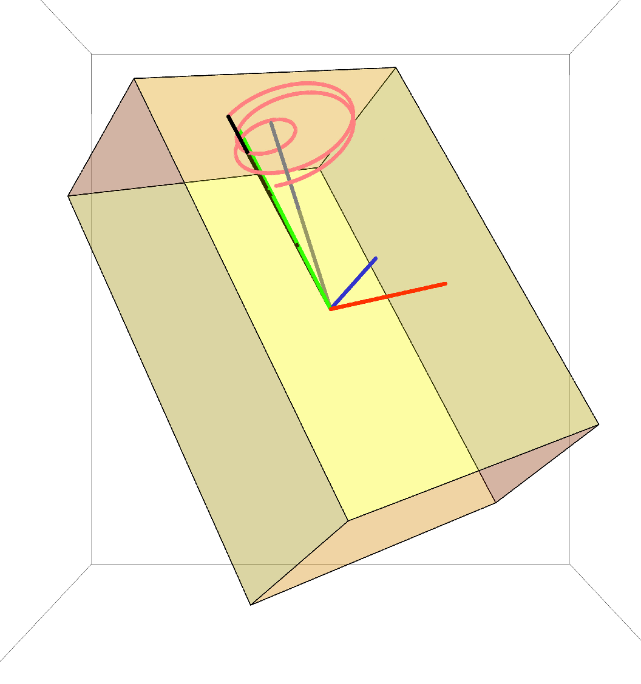

# Package for symbolic calculations with quaternions.

Quaternions package implements Hamilton’s quaternion algebra.
This package mimics original Mathematica Quaternions.m, however,
it fixes various bugs and also allows symbolic transformations
of quaternions to more extent than Mathematica's original.

